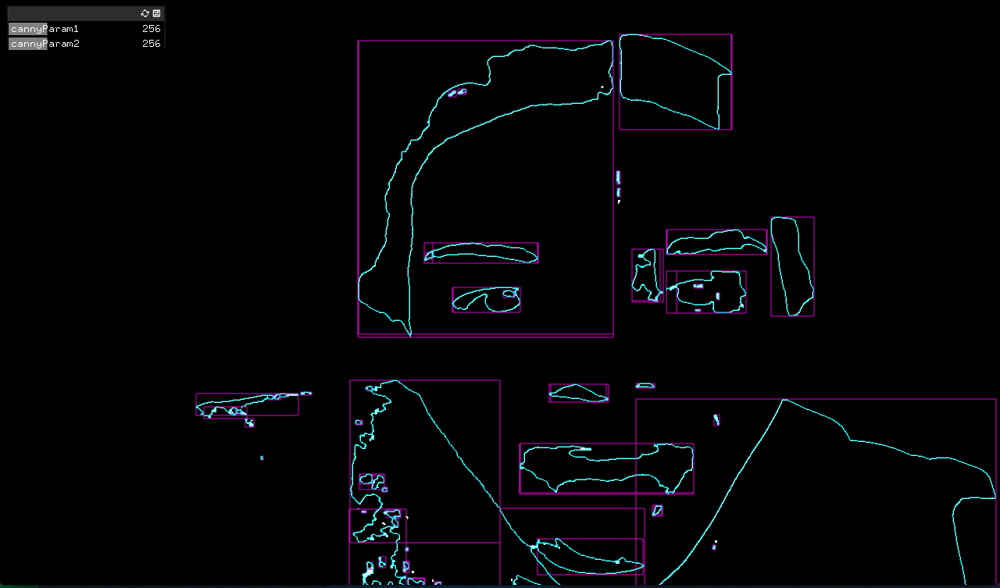
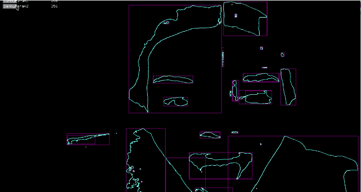
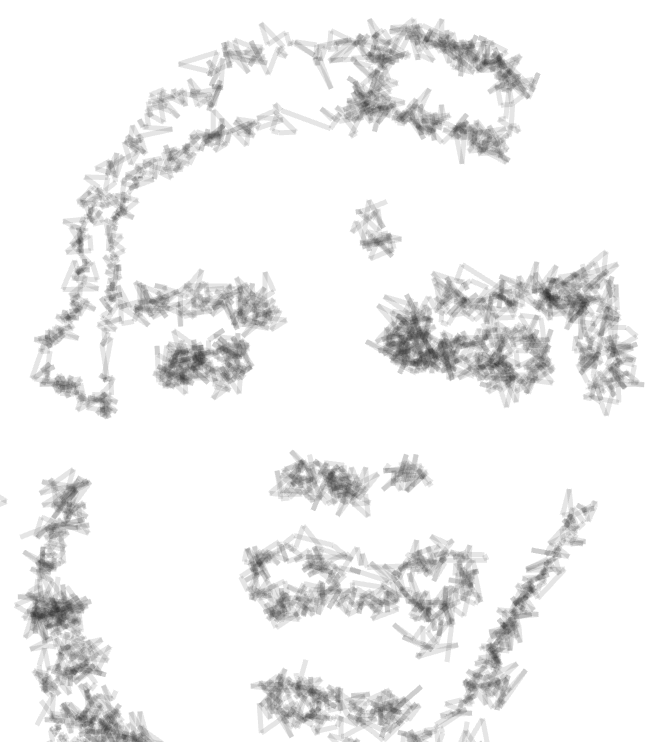
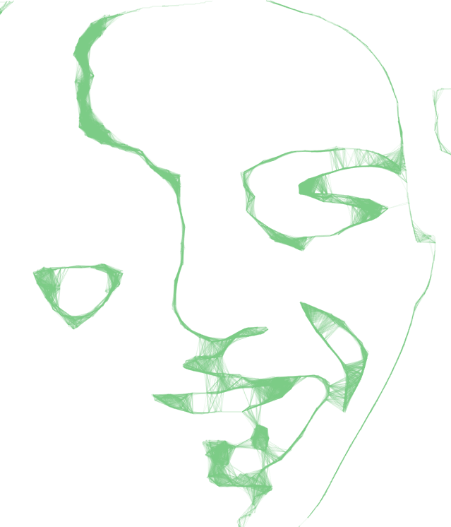
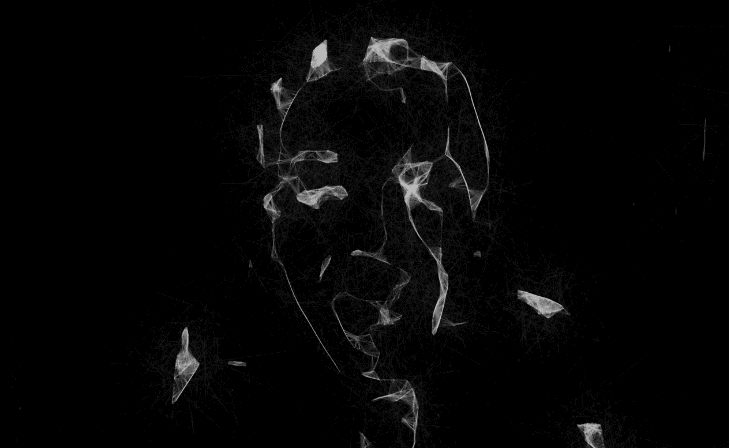
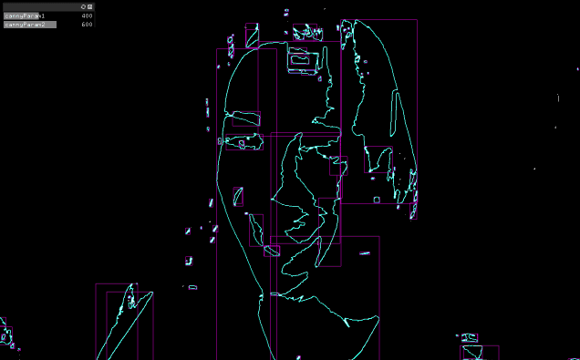
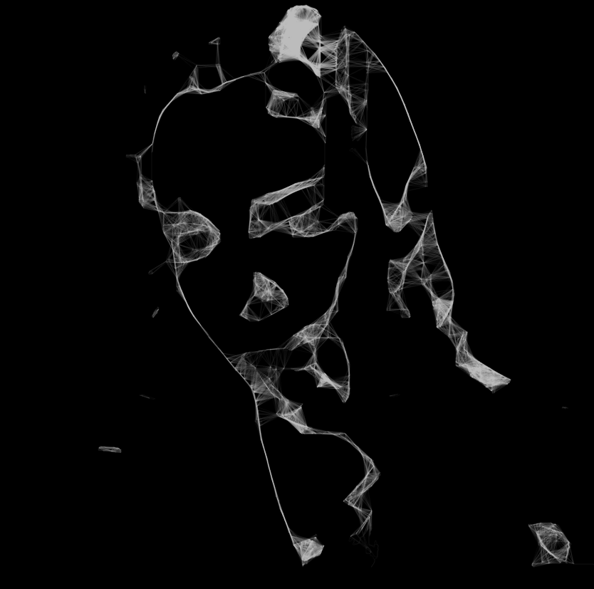
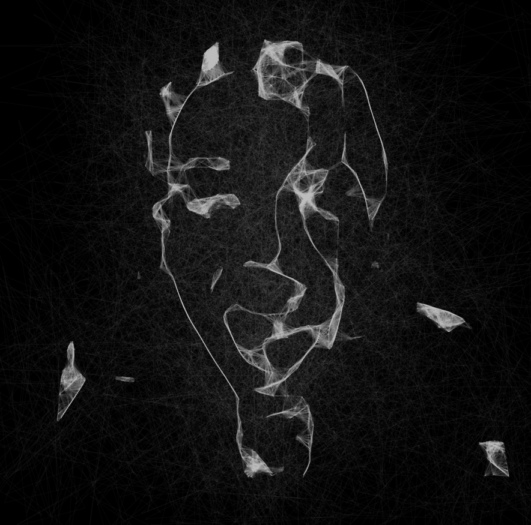

ofxEdgeDetectionPortraitDrawing
=====

This openframeworks app uses canny edge detection and background substraction to find relevant contours in a scene taken from a webcam. It redraws the contours using a generative drawing algorithm.

  

   

Early versions of the drawing program
----
     

    

    

Current version
---

   

   

   

   

  

Features to improve
---
The edge detection component is crucial in order to obtain a good portrait to seed into the program. Small tweaks in lighting and in the preparation of the image can make a huge difference. I'll continue to play with this segment of the program to see how I can improve the accuracy of the detection algorithm.